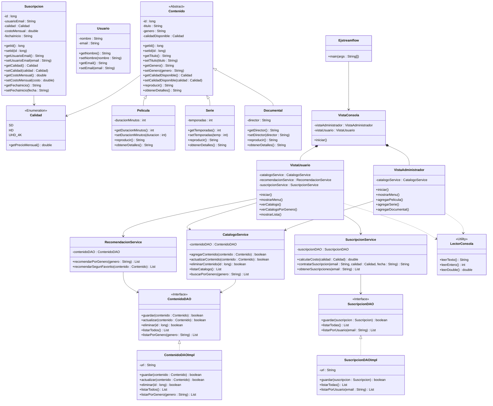

# StreamFlow - Sistema de Gestión de Contenido

## Descripción

**StreamFlow** es una aplicación desarrollada en Java que implementa un sistema de gestión para una plataforma de streaming digital.

El sistema permite administrar un catálogo de contenidos multimedia (películas, series y documentales), gestionar las suscripciones de los usuarios y realizar recomendaciones basadas en el género del contenido.

La arquitectura sigue el patrón **MVC (Model - View - Controller/Service)** utilizando persistencia en **SQLite** mediante JDBC y aplicando principios **SOLID** para obtener un código desacoplado, extensible y fácil de mantener.

---

# Arquitectura del proyecto

```
streamflow
│
├── app
│   └── Ejstreamflow.java
│
├── modelo
│   ├── Contenido.java
│   ├── Pelicula.java
│   ├── Serie.java
│   ├── Documental.java
│   ├── Usuario.java
│   ├── Suscripcion.java
│   └── Calidad.java
│
├── dao
│   ├── ContenidoDAO.java
│   ├── ContenidoDAOImpl.java
│   ├── SuscripcionDAO.java
│   └── SuscripcionDAOImpl.java
│
├── service
│   ├── CatalogoService.java
│   ├── RecomendacionService.java
│   └── SuscripcionService.java
│
├── vista
│   ├── VistaConsola.java
│   ├── VistaAdministrador.java
│   ├── VistaUsuario.java
│   └── LectorConsola.java
│
└── test
    ├── dao
    ├── modelo
    └── service
```

---

# Patrón MVC

## Modelo (Model)

Representa la información del negocio.

Clases:

- Contenido (abstracta)
- Pelicula
- Serie
- Documental
- Usuario
- Suscripcion
- Calidad (Enum)

Responsabilidades:

- Almacenar información.
- Implementar comportamiento propio de cada tipo de contenido.
- Servir como entidades persistentes.

---

## Vista (View)

Responsable de la interacción con el usuario.

Clases:

- VistaConsola
- VistaAdministrador
- VistaUsuario
- LectorConsola

Responsabilidades:

- Mostrar menús.
- Leer información.
- Mostrar resultados.

No contiene lógica del negocio.

---

## Servicios (Controller + Business Logic)

Los Services contienen toda la lógica de negocio.

Clases:

- CatalogoService
- SuscripcionService
- RecomendacionService

Responsabilidades:

- Validaciones.
- Reglas de negocio.
- Comunicación con la capa DAO.

---

## Persistencia (DAO)

Responsable exclusivamente del acceso a la base de datos.

Interfaces

- ContenidoDAO
- SuscripcionDAO

Implementaciones

- ContenidoDAOImpl
- SuscripcionDAOImpl

Utilizan:

- SQLite
- JDBC
- PreparedStatement
- ResultSet

---

# Diagrama UML (Mermaid)


---

# Descripción de las clases

## Contenido

Clase abstracta que representa cualquier contenido multimedia disponible en la plataforma.

Responsabilidades:

- Almacenar título.
- Género.
- Calidad disponible.
- Definir el comportamiento común para todos los contenidos.

Es la base del polimorfismo.

---

## Pelicula

Hereda de Contenido.

Añade:

- Duración en minutos.

Sobrescribe los métodos heredados para mostrar información específica.

---

## Serie

Hereda de Contenido.

Añade:

- Número de temporadas.

Implementa su propia versión de reproducción y detalles.

---

## Documental

Hereda de Contenido.

Añade:

- Director.

Implementa comportamiento especializado.

---

## Usuario

Representa un usuario registrado.

Almacena:

- Nombre
- Email

---

## Suscripcion

Representa la suscripción activa del usuario.

Contiene:

- Calidad
- Costo mensual
- Usuario asociado

---

## Calidad

Enum encargado de representar los planes disponibles.

Cada valor contiene directamente su precio:

- SD
- HD
- UHD_4K

Esto evita usar múltiples condicionales.

---

## CatalogoService

Gestiona:

- Alta de contenidos.
- Listado.
- Actualización.
- Eliminación.

No conoce SQLite directamente.

Depende únicamente de la interfaz ContenidoDAO.

---

## RecomendacionService

Obtiene contenidos del DAO.

Filtra por género.

Implementa las reglas de recomendación.

---

## SuscripcionService

Calcula automáticamente el precio mensual según la calidad seleccionada.

Gestiona:

- Registro de suscripciones.
- Consulta del historial.

---

## ContenidoDAO

Contrato para la persistencia del catálogo.

Define operaciones CRUD.

---

## ContenidoDAOImpl

Implementación concreta utilizando SQLite y JDBC.

---

## SuscripcionDAO

Interfaz para la persistencia de suscripciones.

---

## SuscripcionDAOImpl

Implementación JDBC para SQLite.

---

# Implementación de la Base de Datos

El sistema utiliza una base de datos local SQLite.

La persistencia se realiza mediante JDBC.

Cada DAO:

- abre una conexión
- prepara consultas SQL
- ejecuta PreparedStatement
- procesa ResultSet
- cierra recursos

Las entidades persistidas son:

## Tabla Contenido

|Campo|Tipo|
|------|----|
|id|INTEGER|
|titulo|TEXT|
|genero|TEXT|
|tipo|TEXT|
|calidad|TEXT|
|duracion|INTEGER|
|temporadas|INTEGER|
|director|TEXT|

---

## Tabla Suscripcion

|Campo|Tipo|
|------|----|
|id|INTEGER|
|usuarioEmail|TEXT|
|calidad|TEXT|
|costoMensual|REAL|

---

# Aplicación de SOLID

## SRP

Cada clase posee una única responsabilidad.

Ejemplos:

- DAO → Persistencia
- Service → Lógica
- Vista → Interfaz
- Modelo → Datos

---

## OCP

Para agregar un nuevo contenido como:

- Podcast
- Audiolibro

únicamente sería necesario crear una nueva clase que herede de Contenido.

No sería necesario modificar los Services.

---

## LSP

Pelicula, Serie y Documental pueden tratarse como objetos Contenido.

Los Services trabajan con listas de Contenido sin conocer el tipo concreto.

---

## ISP

Las interfaces DAO contienen únicamente los métodos necesarios.

No existen interfaces gigantes con operaciones innecesarias.

---

## DIP

Los Services dependen de:

```
ContenidoDAO
```

y no de

```
ContenidoDAOImpl
```

Esto facilita:

- pruebas unitarias
- uso de mocks
- cambio de motor de base de datos

---

# Polimorfismo

El proyecto utiliza polimorfismo mediante la clase abstracta **Contenido**.

Los métodos como:

- reproducir()
- obtenerDetalles()

son implementados por:

- Pelicula
- Serie
- Documental

Esto evita grandes bloques de:

```
if
switch
```

y permite extender el sistema fácilmente.

---

# Pruebas Unitarias

El proyecto incluye pruebas con **JUnit 5**.

Se validan:

- Persistencia en SQLite.
- DAO.
- Services.
- Polimorfismo.
- Enum Calidad.
- Cálculo de suscripciones.

---

# Flujo de funcionamiento

```text
Usuario

↓

Vista

↓

Service

↓

DAO

↓

SQLite

↓

DAO

↓

Service

↓

Vista
```

---

# Posibles mejoras

- Implementar un controlador separado (Controller) para desacoplar completamente la vista de los servicios.
- Incorporar autenticación de usuarios.
- Implementar favoritos e historial de reproducciones.
- Añadir soporte para Podcast y Audiolibros aprovechando el principio OCP.
- Migrar a un ORM como Hibernate en futuras versiones.
- Implementar inyección de dependencias (por ejemplo, con Spring) para reforzar el principio DIP.

---

# Tecnologías utilizadas

- Java
- SQLite
- JDBC
- JUnit 5
- NetBeans
- Git/GitHub
- Mermaid (diagramas UML)
